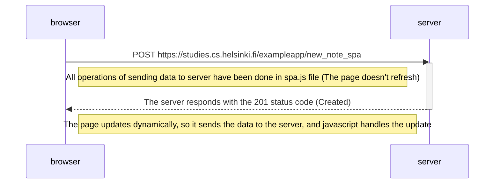

```mermaid
  sequenceDiagram
    participant browser
    participant server

    browser->>server: POST https://studies.cs.helsinki.fi/exampleapp/new_note_spa
    activate server

    Note right of browser: All operations of sending data to server have been done in spa.js file (The page doesn't refresh)
    
    server-->>browser: The server responds with the 201 status code (Created)
    deactivate server

    Note right of browser: The page updates dynamically, so it sends the data to the server, and javascript handles the update
```